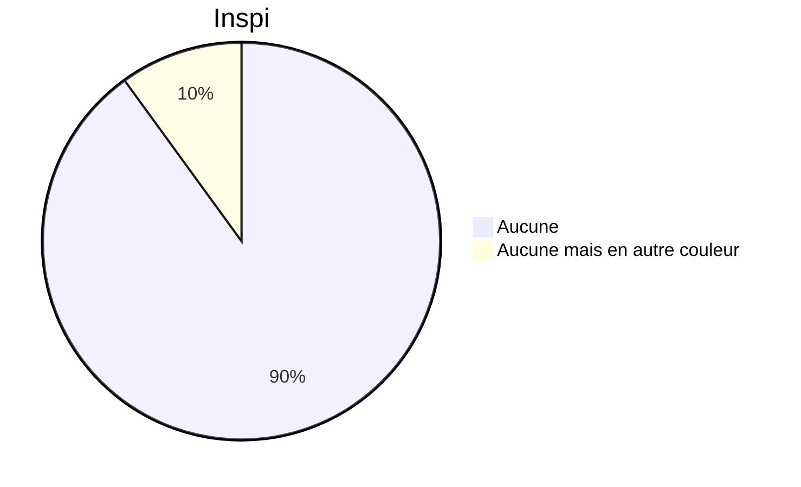

# FAS1002_JamesRoy

Ce répertoire est mon rapport en lien avec le travail final du cours [FAS1002](https://admission.umontreal.ca/cours-et-horaires/cours/fas-1002/) donné par [Samuel Guay](https://github.com/SamGuay).

## Instructions

1.  Télécharger le répertoire.

2.  Rendre le site quarto (render Website dans RStudio)

3.  Suivre les instructions directement intégrés dans le site.

## Données utilisées :

-   Données sur les émissions de CO2 de @owidco2andothergreenhousegasemissions

-   Données sur l'énergie de @owidenergy

-   Données sur l'espérance de vie de @lifeexp

## Inspiration pour ce README

**C'est du markdown, mais pourquoi mon piechart marche pas cr*****

## Licence

Cette œuvre est mise à disposition selon les termes de la [licence Creative Commons Attribution - Partage dans les Mêmes Conditions 4.0 International](http://creativecommons.org/licenses/by-sa/4.0/deed.fr).

